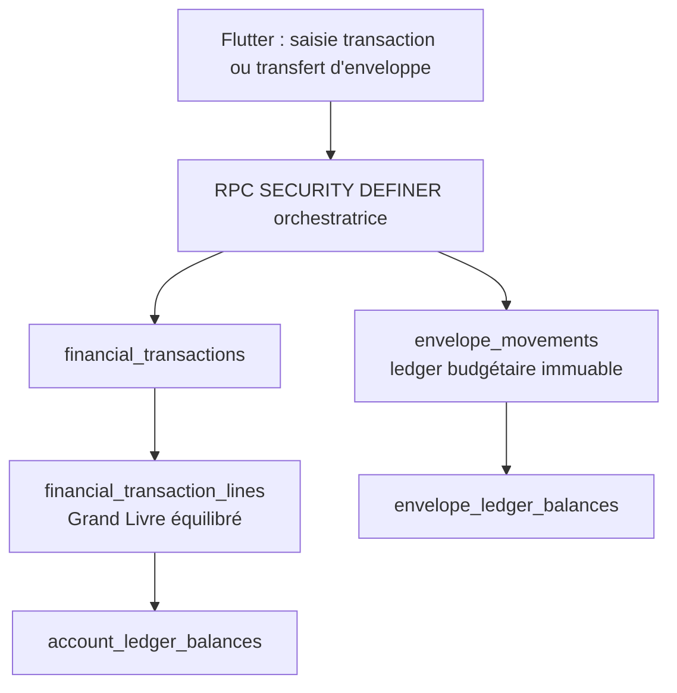

# Sprint 2.2 — Architecture Transactions ↔ Enveloppes

## Décision

Le Grand Livre et les enveloppes restent deux sous-ledgers distincts et
complémentaires :

- le Grand Livre explique **où se trouve** l'argent, par comptes ;
- le ledger des enveloppes explique **à quoi il est destiné**, par budgets.

La source de vérité opérationnelle proposée pour les enveloppes est une table
append-only `envelope_movements`. Les soldes d'enveloppes sont dérivés d'une
vue ; ils ne sont jamais enregistrés comme une valeur modifiable.

## État existant analysé

| Composant | État actuel | Réutilisation / écart |
|---|---|---|
| `public.envelopes` | Référentiel par foyer, nom unique, archivage | À réutiliser ; ajouter ultérieurement son statut système/verrouillé. |
| `public.transactions` | Ancien journal budgétaire, modifiable par les membres | Ne doit plus devenir une source de vérité ; il reste à migrer ou archiver. |
| `financial_transactions` | Entête comptable immuable, type, montant, comptes source/destination | Source de liaison pour les opérations bancaires. |
| `financial_transaction_lines` | Double écriture débit/crédit ; `envelope_id` nullable historique | Ne pas l'utiliser comme ledger d'enveloppes futur : insuffisant pour les splits, revenus à répartir et transferts sans banque. |
| `envelope_balances` / `envelope_monthly_movements` | Vues historiques basées sur `financial_transaction_lines.envelope_id` | À remplacer progressivement par les vues du nouveau ledger d'enveloppes. |
| Import Fondation / Journal | Analyse du classeur et calcul local à partir du snapshot | À conserver comme archive/source de migration, pas comme moteur quotidien. |
| `EnvelopeDashboardPage` | Affichage dérivé du fichier importé, sans persistance distante | À raccorder plus tard à `envelope_ledger_balances`. |

## Modèle recommandé

### `envelope_movements`

| Colonne | Règle |
|---|---|
| `id uuid` | Clé primaire. |
| `household_id uuid` | Obligatoire ; même foyer que l'enveloppe et la transaction liée. |
| `envelope_id uuid` | Obligatoire ; référence une enveloppe du foyer. |
| `financial_transaction_id uuid nullable` | Obligatoire pour une dépense, un revenu ou un remboursement bancaire ; nul pour un transfert entre enveloppes. |
| `movement_group_id uuid` | Obligatoire ; groupe atomique d'un split ou d'un transfert. |
| `movement_type text` | `allocation`, `consumption`, `transfer_out`, `transfer_in`, `refund`, `adjustment`, `reversal`. |
| `amount numeric(14,2)` | Strictement positif ; jamais nul. Le Grand Livre utilise déjà MAD à deux décimales ; Flutter conserve les centimes via `Money`. |
| `direction text` | `inflow` ou `outflow` ; impose le signe budgétaire sans montant négatif. |
| `occurred_at timestamptz` | Obligatoire. |
| `description text` | Obligatoire, lisible et bornée comme le Grand Livre. |
| `created_by uuid` / `created_at` | Audit minimal. |
| `reversal_of uuid nullable` | Référence un mouvement annulé ; une correction est une nouvelle ligne. |

Le signe calculé est : `+amount` pour `inflow`, `-amount` pour `outflow`.
Les types ont un sens imposé sauf `adjustment` et `reversal`, pour lesquels
`direction` porte explicitement la décision.

### Vue `envelope_ledger_balances`

Vue `security_invoker` par enveloppe :

`SUM(CASE direction WHEN 'inflow' THEN amount ELSE -amount END)`

Elle expose au minimum : `household_id`, `envelope_id`, `envelope_name`,
`ledger_balance`, mouvement mensuel et statut système. Les anciennes vues ne
sont retirées qu'après migration validée des données historiques.

## Règles métier par opération

| Opération | Grand Livre | Mouvements d'enveloppe | Règle d'équilibre |
|---|---|---|---|
| Dépense | Débit contrepartie Dépenses, crédit compte payé | Une ou plusieurs lignes `consumption` / `decrease` | Somme des enveloppes = montant de la dépense. |
| Revenu | Débit compte reçu, crédit contrepartie Revenus | Une ligne `allocation` / `increase` vers **À répartir** | Montant alimenté = montant du revenu. |
| Virement bancaire | Débit compte destination, crédit compte source | Aucune | Aucun effet budgétaire. |
| Ajustement de compte | Écriture contre compte Ajustements | Aucune par défaut | Une enveloppe Ajustements n'est créée que si une règle métier validée le demande. |
| Transfert d'enveloppes | Aucune écriture bancaire | Deux lignes : `transfer_out` puis `transfer_in` | Même `movement_group_id`, mêmes montants, total budgétaire nul. |
| Remboursement | Revenu/récupération vers le compte | `refund` / `increase` vers l'enveloppe de dépense d'origine, ou Non affecté | Montant du remboursement affecté intégralement. |
| Split | Une transaction bancaire unique | Plusieurs mouvements d'enveloppe | Somme des montants = montant concerné. |

### Dépense

Une dépense est refusée si aucune affectation n'est fournie. L'unique exception
est l'enveloppe système explicite **Non affecté**, choisie volontairement ; elle
crée une tâche de régularisation et ne masque jamais l'écart.

### Revenu

Le revenu n'alimente jamais arbitrairement les budgets métier. Il crédite
d'abord **À répartir**. Les alimentations ultérieures sont des transferts
d'enveloppes, auditables et sans mouvement bancaire.

### Ajustement

Par défaut un ajustement de compte ne touche pas le budget. Le produit pourra
autoriser ultérieurement une affectation volontaire à **Ajustements**, mais ce
n'est pas une déduction automatique.

### Remboursement

La migration Sprint 2.1 admet `recovery` dans la contrainte SQL, alors que la
RPC `create_ledger_transaction` et le modèle Flutter n'exposent pas encore ce
type. Avant d'implémenter les remboursements, ce contrat doit être unifié dans
un lot dédié ; aucune règle de remboursement ne doit être simulée via une
dépense ou un revenu générique.

## Atomicité recommandée

Retenir **une RPC orchestratrice dédiée**, par exemple
`create_budgeted_ledger_transaction`, plutôt qu'un enchaînement Flutter de
plusieurs RPC.

Elle reçoit l'intention validée, les affectations d'enveloppes et les comptes :

1. vérifie `auth.uid()` et l'appartenance au foyer ;
2. valide comptes, enveloppes, montants et règles par type ;
3. crée l'entête comptable et les deux lignes du Grand Livre ;
4. crée les `envelope_movements` associés dans la même transaction SQL ;
5. laisse le trigger différé du Grand Livre vérifier débit = crédit ;
6. retourne un identifiant unique ou échoue sans écriture partielle.

Cette RPC peut réutiliser les règles de `create_ledger_transaction`, mais ne
doit pas l'appeler depuis Flutter puis compléter les enveloppes ensuite : ce
serait une fenêtre d'incohérence. Le transfert entre enveloppes utilise une
seconde RPC dédiée, sans `financial_transaction_id`.

## Contraintes et sécurité à prévoir

- clé relationnelle garantissant que `envelope_id`, `household_id` et, si
  présente, `financial_transaction_id` appartiennent au même foyer ;
- `amount > 0`, `direction in ('increase','decrease')`, type autorisé ;
- trigger différé pour : somme des consommations d'une dépense = montant,
  somme du revenu vers À répartir = montant, transfert budgétaire nul ;
- déclencheur d'immutabilité : aucun `UPDATE` ni `DELETE` direct ;
- RLS lecture seule pour les membres du foyer ; aucune politique directe
  d'écriture ; seules les RPC `SECURITY DEFINER` validées écrivent ;
- `EXECUTE` seulement pour `authenticated`, jamais `anon`/`PUBLIC` ;
- correction exclusivement par contrepassation, avec `reversal_of` et motif.

Une contrainte SQL simple ne peut pas vérifier une somme multi-lignes : les
invariants de groupe doivent être vérifiés par un trigger différé ou dans la
RPC, puis protégés par l'absence d'écriture directe.

## Enveloppes système

| Enveloppe | Création | Visibilité / sélection |
|---|---|---|
| **À répartir** | Idempotente par foyer dès le premier revenu | Visible avec un statut système ; destination automatique de revenu et source autorisée des alimentations. |
| **Non affecté** | Idempotente au premier besoin de régularisation | Visible avec avertissement ; sélection explicite uniquement, jamais choisie automatiquement. |
| **Ajustements** | Désactivée initialement | À créer seulement après validation d'une règle budgétaire d'ajustement. |

Ces enveloppes seront verrouillées contre archivage, renommage et suppression
dans les parcours ordinaires. Elles restent visibles pour l'audit.

## Interface cible

### Saisie Dépense

Compte payé, montant, libellé, puis une liste d'affectations : enveloppe +
montant. Le total « Affecté / Dépense » reste visible et le bouton est bloqué
tant que l'égalité n'est pas exacte. Ajouter une ligne crée un split.

### Saisie Revenu

Compte destinataire, montant et libellé. L'interface affiche l'affectation
automatique à **À répartir** ; elle ne propose pas de ventilation dans cette
première opération.

### Transfert entre enveloppes

Écran distinct : enveloppe source, enveloppe destination, montant, motif.
Il n'affiche aucun compte bancaire et ne produit aucune ligne du Grand Livre.

### Consultation

Chaque transaction affiche les comptes concernés, les enveloppes concernées,
les montants de ventilation et l'état Non affecté éventuel. Chaque enveloppe
affiche son solde calculé et son historique immuable.

## Transactions historiques et importées

Les transactions existantes, dont `TEST S2 DEPENSE`, `TEST S2 REVENU`,
`TEST S2 VIREMENT` et `TEST S2 AJUSTEMENT`, ne reçoivent aucune enveloppe
inventée rétroactivement.

Une file de régularisation liste les transactions bancaires sans mouvement
d'enveloppe : l'utilisateur choisit une ou plusieurs enveloppes, ou **Non
affecté** avec motif. Les virements et les ajustements y sont exclus par règle
par défaut. Le Journal Excel existant est importé comme archive traçable et
nécessite une confirmation de correspondance, ligne par ligne si nécessaire.

## Cas limites

- Enveloppe archivée : consultable dans l'historique, non sélectionnable pour
  une nouvelle affectation.
- Solde d'enveloppe négatif : autorisé seulement si la politique de découvert
  budgétaire du foyer est explicitement définie ; sinon blocage en RPC.
- Transaction annulée : contrepassation comptable et budgétaire atomique, pas
  de suppression.
- Split arrondi : tous les montants sont en centimes côté Flutter et
  `numeric(14,2)` côté SQL ; la somme doit être exacte au centime.
- Compte ou enveloppe d'un autre foyer : refusé avant toute écriture par la
  RPC et les clés relationnelles.

## Critères d'acceptation Sprint 2.2

1. Une dépense ne peut être validée sans enveloppe ou Non affecté explicite.
2. Un split est atomique et sa somme égale exactement la dépense.
3. Un revenu alimente À répartir, sans alimentation implicite d'un budget.
4. Un virement bancaire n'altère aucune enveloppe.
5. Un transfert d'enveloppes n'altère aucun compte et conserve le total.
6. Tous les soldes affichés proviennent de vues calculées.
7. Toute correction crée une contrepassation lisible et auditée.
8. RLS, RPC et tests empêchent toute écriture directe ou inter-foyers.

## Plan d'implémentation par lots

1. **Fondation SQL** : table, contraintes inter-foyer, RLS, vues, enveloppes
   système et migrations de compatibilité, sans UI.
2. **RPC atomiques** : dépense ventilée, revenu vers À répartir, transfert
   d'enveloppes, contrepassation ; tests SQL et Dart.
3. **Flutter Transactions** : sélecteur d'enveloppe, split, totaux et erreurs
   avant validation ; rafraîchissement transaction/enveloppe/solde.
4. **Flutter Enveloppes** : remplacer l'affichage issu du snapshot par les
   vues distantes et l'historique des mouvements.
5. **Régularisation historique** : file des transactions non affectées,
   import confirmé et rapports d'écarts.
6. **Remboursements** : unifier d'abord le contrat `recovery`, puis rattacher
   le remboursement à son enveloppe d'origine.

## Lot 1 livré — fondation SQL sans migration historique

La migration additive `202608050002_envelope_ledger.sql` introduit :

- `public.envelope_movements`, avec des montants MAD `numeric(14,2)` toujours
  positifs et un sens explicite `inflow` / `outflow` ;
- des clés étrangères composites empêchant les liaisons entre foyers pour
  enveloppe, transaction financière, créateur et contrepassation ;
- une règle append-only (RLS lecture seule et trigger qui refuse `UPDATE` et
  `DELETE`) ;
- l'enveloppe système idempotente **À répartir**, identifiée par le code stable
  `to_allocate` et verrouillée contre renommage, archivage et suppression ;
- la vue `envelope_ledger_balances`, qui calcule les entrées, sorties et le
  solde sans stocker de balance ;
- des contrôles différés de groupes pour les dépenses ventilées, les revenus,
  les transferts et les contrepassations ;
- `create_envelope_transfer`, RPC `SECURITY DEFINER` réservée à
  `authenticated`, qui écrit les deux mouvements d'un transfert dans une seule
  transaction.

Les transactions et snapshots historiques restent inchangés dans ce lot. Ils
ne seront jamais convertis automatiquement : une future étape de
régularisation demandera une confirmation explicite pour toute affectation.
