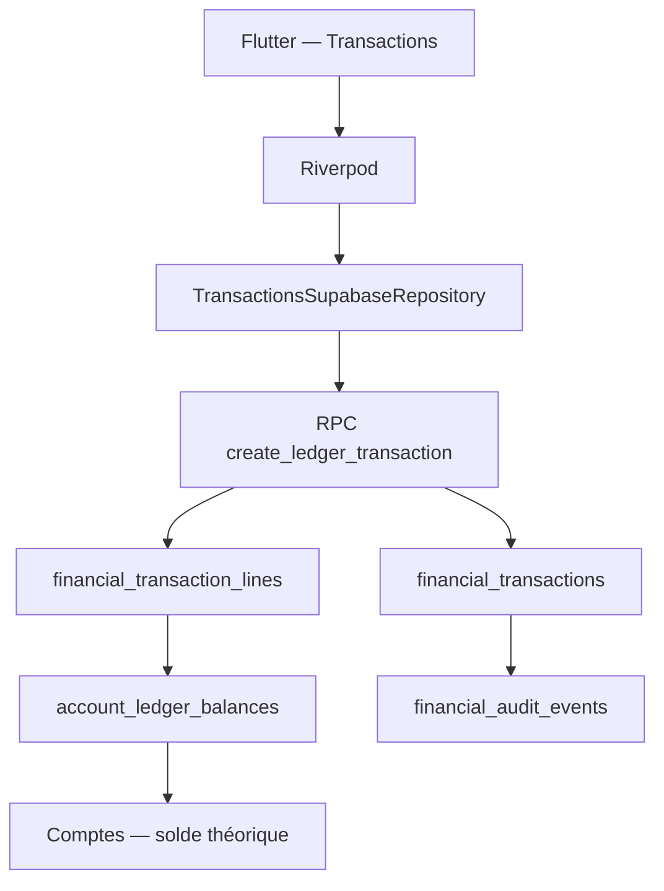

# Sprint 2.1 — Architecture du moteur financier

## Décision principale

Le Grand Livre est la source de vérité des mouvements financiers. Les comptes
conservent uniquement leur solde d'ouverture historique ; leur solde théorique
est calculé par la vue SQL `account_ledger_balances` :

`solde_ouverture + somme(debits) - somme(credits)` pour les actifs ; pour un
emprunt, la formule est volontairement inversée (`ouverture + crédits -
débits`) afin qu'un remboursement diminue la dette affichée.

Une transaction validée est immuable. Une correction est une nouvelle
transaction de type `correction` : elle ne réécrit jamais l'historique.

## Partie double

Chaque écriture comporte un débit et un crédit positifs ou nuls. La RPC crée
les deux lignes dans une unique transaction PostgreSQL et vérifie que le total
des débits est égal au total des crédits.

Les comptes bancaires, espèces, épargne et emprunts sont les comptes visibles.
Les contreparties nécessaires à une dépense, un revenu, un ajustement ou un
solde d'ouverture sont des comptes techniques masqués (`is_system = true`).
Ils évitent toute écriture déséquilibrée sans apparaître dans l'interface des
comptes.

| Type | Débit | Crédit |
| --- | --- | --- |
| Dépense | Compte technique Dépenses | Compte payé |
| Revenu | Compte encaissé | Compte technique Revenus |
| Virement | Compte destinataire | Compte source |
| Ajustement / correction | Compte ou Ajustements selon le sens | Contrepartie |
| Solde d'ouverture | Compte ou Équilibre d'ouverture selon le sens | Contrepartie |

## Responsabilités

- `FinancialTransactionDraft` décrit une intention utilisateur validable, sans
  SQL ni widget.
- `LedgerPostingBuilder` génère les deux lignes équilibrées pour cette
  intention.
- `TransactionsSupabaseRepository` transforme le brouillon en appel RPC.
- La RPC vérifie le foyer, les comptes, la catégorie et l'équilibre, puis
  écrit transaction, lignes et audit atomiquement.
- Les providers Riverpod exposent exclusivement les listes distantes et les
  opérations asynchrones à l'UI.
- Les widgets n'écrivent jamais directement dans Supabase.

## Immutabilité et audit

Les tables restent en lecture directe pour les membres du foyer. Les écritures
sont réservées à la RPC `create_ledger_transaction`, exécutée avec le contrôle
`auth.uid()` et `is_household_member`. Toute validation crée un évènement
`financial_audit_events`. Une annulation future devra créer une transaction de
correction liée, jamais modifier une ligne existante.

## Dépendances

Le Sprint 2.1 dépend uniquement des fondations Sprint 1 : authentification,
foyer actif, `accounts`, `categories`, `financial_transactions`,
`financial_transaction_lines` et `financial_audit_events`. La migration
Sprint 2 est additive et ne réécrit aucune migration précédente.

## Import bancaire futur

Le coeur expose une frontière `ImportedBankTransactionCandidate`. Les lecteurs
CSV bancaire, OFX, QIF et CAMT seront des adaptateurs qui produisent cette
structure ; ils ne contourneront ni le domaine ni la RPC du Grand Livre.
